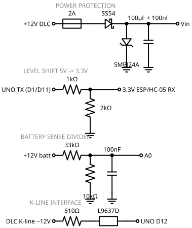
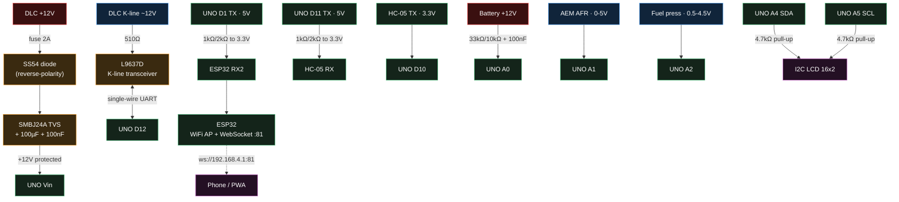

ArduinoHondaOBD
===========

An arduino code that reads Honda OBD Protocol and translates it to ELM327 protocol.
I use Torque app to read and display the data on my android phone (via bluetooth),
and a LCD (2x6) to display it on my car's dashboard.

Please refer to the screenshots below.

Applications
--------
* Datalogging
* Diagnostics
* Trip Computer
* Etc


Supports
--------
* Honda ECU's before 2002


Files
-----
* hobd_uni - unified code for ELM bluetooth and LCD display with other improvements.
* hobd_elm - implements Honda OBD to ELM OBD2 protocol (bluetooth) - not updated
* hobd_lcd - implements Honda OBD to LCD display - not updated
* hobd_esp - ESP32 WiFi/WebSocket co-processor: rebroadcasts the live data and serves the dashboard
* dashboard - installable PWA web dashboard (live gauges over WebSocket)
* UNI_wiring.png - Unified wiring diagram for arduino UNO (compatible)


Live WiFi Dashboard (ESP32 + PWA)
---------------------------------
Pair `hobd_uni` (Arduino UNO) with an `hobd_esp` (ESP32) co-processor to view the
live OBD data on any phone, tablet, or laptop over WiFi — no app store, no internet
needed.

How it works:

    Honda ECU --K-line--> Arduino UNO (hobd_uni) --UART JSON--> ESP32 (hobd_esp)
                                                                  |  WiFi Access Point
                                                                  |  + WebSocket server
                                                                  v
                                                        phone / tablet / laptop
                                                        (PWA, ws://192.168.4.1:81)

- The UNO streams a compact JSON line (~4 Hz) to the ESP32 over the hardware UART
  (D1 TX -> ESP RX through a 1k/2k divider; see the schematic above).
- The ESP32 runs its own WiFi hotspot ("HondaOBD", 192.168.4.1), rebroadcasts each
  line over a WebSocket, and serves the dashboard page from its flash (LittleFS).
- Open `http://192.168.4.1` in any browser and "Add to Home Screen" to install it
  as a full-screen PWA. It shows a shift-light tachometer, speed, coolant/intake
  temps, battery, fuel trims, and a check-engine lamp with decoded DTCs.
- The existing Bluetooth/Torque path keeps working — the WiFi dashboard is additive.

Build & flash (one command each):

    tools/deploy-uni.sh        # UNO firmware
    tools/deploy-esp.sh        # ESP32 firmware + dashboard to LittleFS

See `dashboard/README.md` for the JSON schema and a no-hardware mock server.


Wiring for hobd_uni (Joined ELM and LCD codes)
--------------------
NOTE: the shipped code compiles with `#define LCD_i2c TRUE`, so the live build uses
an **I2C LCD on A4/A5** (not the parallel LCD shown in the legacy image). Pins D4-D9
are free in this build. Wiring table below reflects the I2C build.

    Honda 3 Pin DLC           Arduino Uno
    Gnd --------------------- Gnd
    +12 --------------------- Vin   (through protection, see below)
    K-line ------------------ Pin12 (through K-line interface, see below)

    HC-05 Bluetooth           Arduino Uno
    Rx ---------------------- Pin11 (through 1k/2k divider -> 3.3V, see below)
    Tx ---------------------- Pin10

    LCD 16x2 (I2C backpack)   Arduino Uno
    SDA --------------------- Pin18 (A4)   (4.7k pull-up to +5V)
    SCL --------------------- Pin19 (A5)   (4.7k pull-up to +5V)
    VCC --------------------- +5V
    GND --------------------- Gnd

    Piezo Buzzer              Arduino Uno
    (+) --------------------- Pin13   (piezo element, or via transistor)
    (-) --------------------- Gnd

    Tact Switch               Arduino Uno
    (+) --------------------- Pin17 (A3)   (uses internal pull-up)
    (-) --------------------- Gnd

    Voltage Divider           Arduino Uno
    +12V divider circuit ---- Pin14 (A0)
    (33k ohms and 10k ohms, 100nF from A0 to Gnd)

    AEM AFR UEGO (0-5V)       Arduino Uno
    Signal ------------------ Pin15 (A1)

    100psi Fuel Pressure      Arduino Uno
    Signal (0.5-4.5V) ------- Pin16 (A2)


Required protection / interface (do NOT skip before connecting to a car)
--------------------
The Honda DLC supplies raw +12V and the K-line idles near battery voltage. Neither
can touch the Arduino directly. The diagram below is the safe, working wiring.
(Diagrams are generated from `tools/schematic/wiring.py` — run
`tools/gen-schematic.sh` after editing it.)

Complete build schematic — every component (UNO with all pins, ESP32, HC-05,
I2C LCD, K-line transceiver, power protection, sensors, buttons, buzzer).
Power/ground use net symbols: every `+5V` ties together, every ground symbol
ties together.


A zoomed-in symbol-level view of just the protection front-end:



Full connectivity (auto-generated):

<!-- SCHEMATIC:MERMAID:START (generated by tools/gen-schematic.sh, do not edit) -->

<!-- SCHEMATIC:MERMAID:END -->

Plain-text fallback (same wiring):

```
                   hobd_uni  —  Arduino UNO (ATmega328P)  —  I2C LCD build
                   ======================================================

  HONDA 3-PIN DLC            PROTECTION / INTERFACE              ARDUINO UNO
  ---------------            ----------------------              -----------

  +12V o--[FUSE 2A]--+--|>|----+----------+----------------------o Vin
                     |  SS54    |          |                       (or feed a
                     | (revpol) |        100uF/50V                 LM2596 buck
                     |         _|_         + 100nF                 to +5V)
                     |         /_\ TVS      |
                     |      SMBJ24A        GND
                     |     (to GND)
                     +--> +12V_prot --> L9637D VB(12), A0 divider top
  GND  o-------------+-----------------------------------------------o GND

  K-line o--[510R]--+----- K-line transceiver  ST L9637D -----------+
                    |   K(7)=bus  VB(12)=+12V_prot  VCC(5)=+5V       |
                    |   GND(8)=GND                                   |
                    |   RX(1) ------------------------------> D12 (read)
                    |   TX(4) <------------------------------ D12 (drive)
                    +-- single-wire half-duplex: RX & TX both tie D12 -+
                        [SoftwareSerialWithHalfDuplex dlcSerial(12,12)]

  HC-05 RXD level shift (5V -> 3.3V):
      D11 o---[ 1k ]---+---o HC-05 RXD
                       |
                     [ 2k ]
                       |
                      GND          = 5V * 2k/(1k+2k) = 3.33V
      HC-05 TXD o------------------o D10   (3.3V is a valid logic-high, no shift)

  +12V sense divider (replaces 680k/220k; lower impedance for the ADC):
      +12V_prot o--[ 33k ]--+--[ 10k ]--GND
                            |
                            +--[100nF]--GND --o A0   (ratio 0.232, source 6k < 10k)
      ** update code: R1 = 33000, R2 = 10000 **
```

Bill of protection parts:

    K-line transceiver   ST L9637D (SO-8)    ISO9141 K-line, 12V<->logic, load-dump safe
    K-line series R      510 ohm 1/4W        DLC K-line -> L9637D K pin
    Reverse-polarity     SS54 Schottky       40V / 5A
    Load-dump clamp      SMBJ24A TVS         24V standoff (> 14.7V charge), 600W
    Bulk input cap       100uF/50V + 100nF   after diode, before regulator
    HC-05 RX shift       1k + 2k resistors   5V -> 3.33V
    A0 divider           33k + 10k + 100nF   ratio 0.232, source 6k
    I2C pull-ups         2x 4.7k to +5V      if not already on the LCD backpack
    Input fuse           2A                  at the DLC +12V feed

(The legacy parallel-LCD diagram below predates the I2C build.)


Wiring for hobd_elm (Deprecated use hobd_uni)
--------------------
    Honda 3 Pin DLC           Arduino Uno
    Gnd --------------------- Gnd
    +12 --------------------- Vin
    K-line ------------------ Pin12

    HC-05 Bluetooth           Arduino Uno               
    Rx ---------------------- Pin11
    Tx ---------------------- Pin10


Wiring for hobd_lcd (Deprecated use hobd_uni)
---------------
    Honda 3 Pin DLC           Arduino Uno
    Gnd --------------------- Gnd
    +12 --------------------- Vin
    K-line ------------------ Pin12

    LCD 16x2                  Arduino Uno               
    RS ---------------------- Pin9
    Enable ------------------ Pin8
    D4 ---------------------- Pin7
    D5 ---------------------- Pin6
    D6 ---------------------- Pin5
    D7 ---------------------- Pin4
    VO ---------------------- 10k Potentiometer (+5V to Gnd)


Screenshots (LCD 16x2)
---------------


Screenshots (Andorid App TORQUE)
---------------


NOTES
-----
* Added button for changing page (5ms) and changing ecu mode (3s).
* Added Fault codes reader @ lcd page 3
* Added LCD @ I2C support
  - #define LCD_i2c TRUE // Using LCD 16x2 I2C mode
* Added direct HOBD access API (ELM mode) used for undefined PIDs on OBD2
  - // direct honda PID access
  - // 1 byte access (21AA) // 21 = 1 byte, AA = address
  - // 2 bytes access (22AA) // 22 = 2 bytes, AA = address
  - // 4 byte access (24AA) // 24 = 4 bytes, AA = address
* Added direct Arduino Pin access API (ELM mode) used for keyless entry and other stuff
  - // set arduino pin (ATSAPNNX) // NN = pin, X = value (value is 1 or 0)
  - // get arduino pin (ATDAPNN) // NN = pin
* Tested on P2T ODB2 stock and P30 ODB1 chipped

TODO
-----
* Add 128x64 LCD @ SPI support
* Add 20x4 LCD @ I2C support
