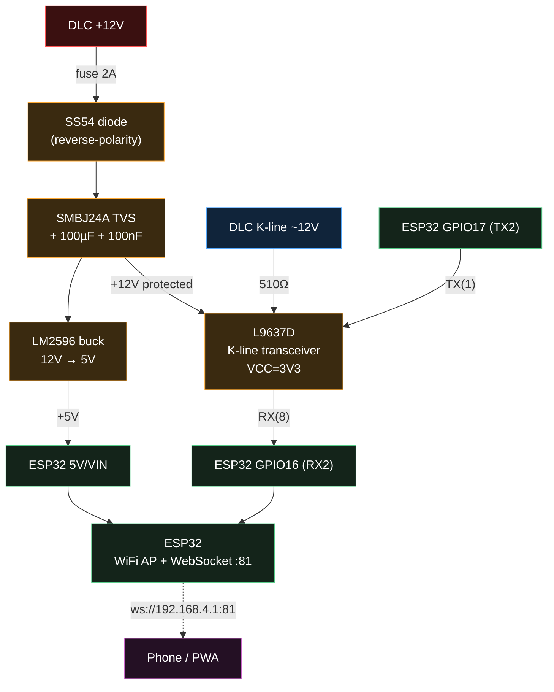

hobd_esp — single-board Honda K-line → WiFi dashboard (ESP32)
============================================================

The ESP32 reads the Honda 3-pin DLC **K-line directly** (no ATmega) and serves the
live PWA dashboard over its own WiFi hotspot. Bluetooth/Torque (ELM327) and the LCD
of the older two-board build are dropped — this is the K-line → WebSocket path only.

Data flow
---------
    Honda ECU --K-line 9600 8N1--> L9637D --UART2--> ESP32 (hobd_esp)
                                                       |  WiFi Access Point
                                                       |  + WebSocket :81
                                                       v
                                             phone / tablet / laptop
                                             (PWA, ws://192.168.4.1:81)

- The K-line reader runs as a FreeRTOS task pinned to core 1, polling the ECU every
  ~250 ms; `loop()` broadcasts one compact JSON line (~4 Hz) to all WebSocket clients.
- The ESP32 runs a WiFi hotspot ("HondaOBD", 192.168.4.1) and serves the dashboard
  from flash (LittleFS). Open `http://192.168.4.1` and "Add to Home Screen".
- The stream is read-only: inbound WebSocket messages are ignored (no pin-write API
  reachable from the network).

See `dashboard/README.md` for the JSON schema and a no-hardware mock server.

Required protection / interface (do NOT skip before connecting to a car)
------------------------------------------------------------------------
The Honda DLC supplies raw +12V and the K-line idles near battery voltage; an ESP32
GPIO is 3.3V and **not** 5V-tolerant. Route the K-line through an **ST L9637D**
transceiver with its logic side (VCC) referenced to 3.3V — then RX/TX are native
3.3V and no divider is needed. Power the ESP32 from a 12V→5V buck with reverse and
transient protection.



Plain-text fallback (same wiring):

```
  HONDA 3-PIN DLC            PROTECTION / L9637D                 ESP32-WROOM
  ---------------            ------------------                  -----------

  +12V o--[FUSE 2A]--+--|>|--+-----------+-----------+--> LM2596 IN
                     |  SS54  |           |           |    LM2596 OUT = 5.0V --> 5V/VIN
                     |(revpol)|         100uF/50V   _|_
                     |        |          + 100nF    /_\ SMBJ24A TVS (to GND)
                     |        +--> +12V_prot --------+--> L9637D VS(6)
  GND  o-------------+------------------ common GND --+--> LM2596 GND, ESP32 GND,
                                                          L9637D GND(4), LI(5)

  K-line o--[510R]--> L9637D K(2)          [12V bus, single-wire half-duplex]

         L9637D VCC(7) <---------------------------- ESP32 3V3   (+100nF to GND)
         L9637D TX(1)  <---------------------------- ESP32 GPIO17 (UART2 TX)
         L9637D RX(8)  ----------------------------> ESP32 GPIO16 (UART2 RX)
         L9637D LO(3) = open    ·    LI(5) = GND
```

Parts
-----
| Part                  | Value / spec              | Role                          |
|-----------------------|---------------------------|-------------------------------|
| ST **L9637D** (SO-8)  | VCC tied to 3V3           | K-line transceiver, 12V↔logic |
| Resistor              | 510 Ω 1/4 W               | K-line series (K pin ↔ DLC)   |
| Schottky **SS54**     | 40 V / 5 A                | reverse-polarity              |
| TVS **SMBJ24A**       | 24 V standoff, 600 W      | load-dump / transient clamp   |
| Cap                   | 100 µF / 50 V             | bulk input                    |
| Cap ×2                | 100 nF ceramic            | input + VCC decoupling        |
| Buck **LM2596** module| set 5.0 V, 40 V max in    | 12 V → 5 V for the ESP32      |
| Fuse                  | 2 A                       | DLC +12V feed                 |
| **ESP32-WROOM** dev   | —                         | WiFi AP + WebSocket           |

Notes:
- **Echo:** through the transceiver the ESP32's own 5 request bytes echo back on RX;
  `dlcCommand()` discards them (`#define KLINE_ECHO 1`). Set `0` only for a rare
  transceiver that tri-states RX during transmit.
- **obd_select** is hardcoded to `1` (OBD1 / B16). Change the `const` and reflash for
  an OBD2 ECU — the RPM formula is the only difference.
- **Pins:** UART2 on GPIO16/17 are clean (no strapping). Avoid GPIO0/2/5/12/15 and
  the flash pins GPIO6–11.

Build & flash
-------------
    tools/deploy-esp.sh [PORT]

Compiles + uploads the firmware AND builds + flashes the dashboard to LittleFS in
one command (PORT auto-detected if omitted). Requires the esp32 core + the libraries
listed at the top of `hobd_esp.ino`.
